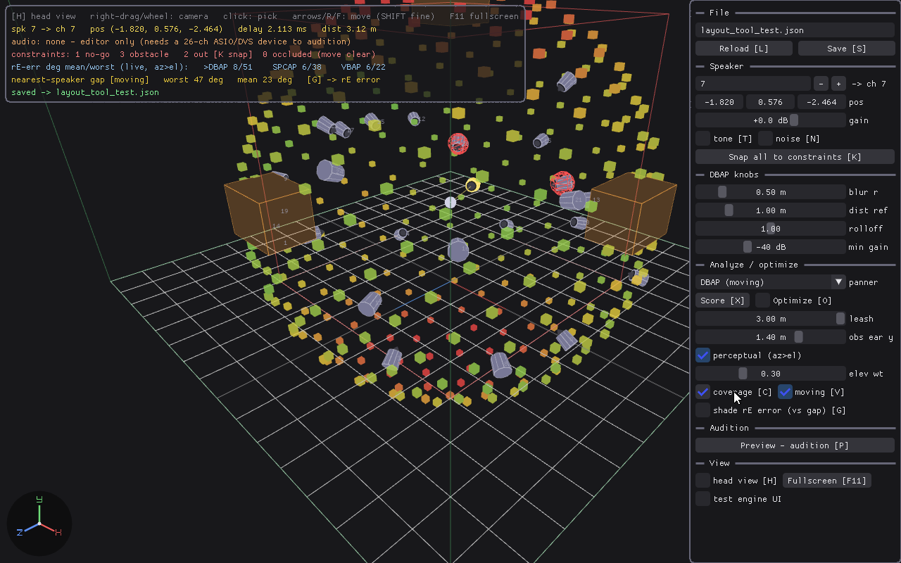
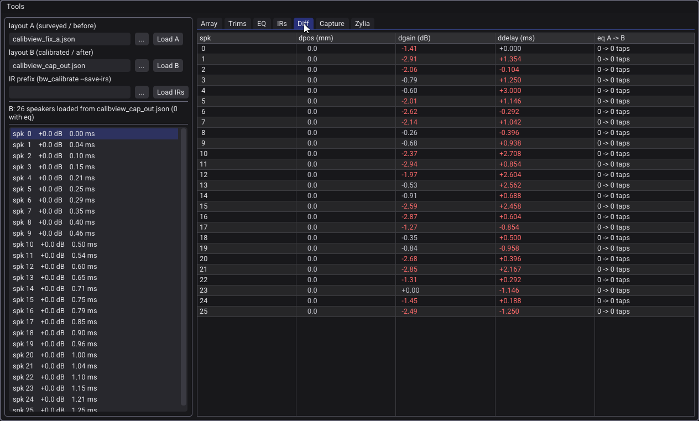
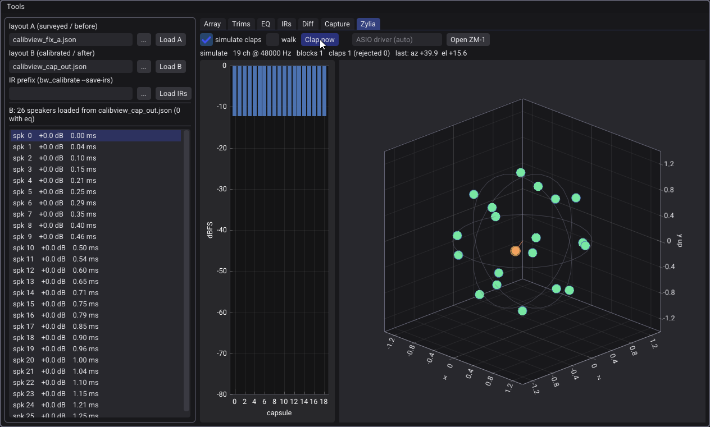
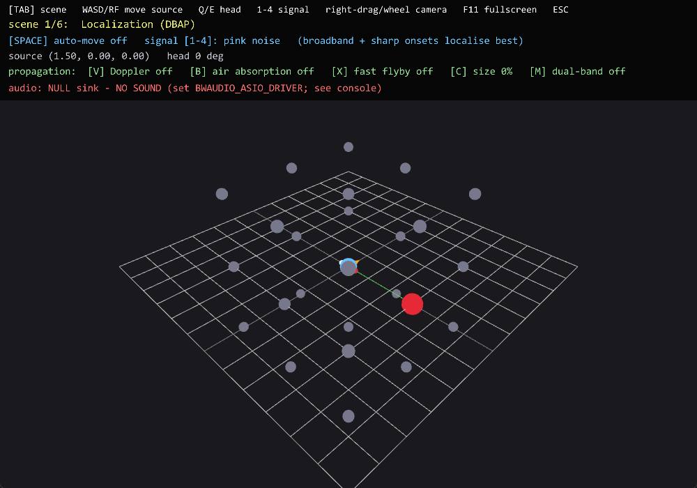

# bwaudio

Self-hosted spatial audio engine for a 26-speaker CAVE installation. Drives the
array over **ASIO → Dante Virtual Soundcard**, with a **binaural HRTF monitor** for
desk-side debugging. Unity and Unreal connect as thin control clients over a C ABI.

> **Status:** implemented through M6 (engine, spatialization, Steam Audio
> materials/reflections/pathing, tracking, calibration, tooling; 18 ctests).
> Remaining: hardware verification at the rig. `include/bwaudio.h` is the
> authoritative contract.

## Why self-hosted

Going direct (no FMOD/Wwise) gives sample-accurate access to ASIO timing hooks and
keeps the core engine-agnostic, so the same library serves both engines with only a
thin per-engine glue layer. The spatializer, mixer, output, and tracking all live
in one process behind one audio callback.

## Shape

```
 engine (Unity/Unreal) ──control──┐
 OptiTrack (NatNet) ─────pose─────┤
                                  ▼
                     ┌─ voice playback ─ DBAP pan ─► 26-ch master bus ─┐
                     │  (one audio callback)                           │
                     └─────────────────────────────────────────────────┘
                                  │                         │
                          ASIO ► DVS ► array        binaural monitor ► stereo
                          (production)              (debug)
```

## Engine features

- **Spatialization**: per-voice listener-relative DBAP (SPCAP/VBAP selectable, a
  dual-band option), recomputed per block from the tracked head position; source
  spread; per-speaker gain/delay/correction-EQ output stage, with a linked
  protection limiter as the final stage.
- **Acoustics** (Steam Audio): ray-traced occlusion with per-band transmission EQ,
  source directivity, a directional reflection bed (real-time, or baked over a
  probe grid), sound pathing around occluders with bending-loss EQ.
- **Propagation**: distance attenuation, Doppler, air absorption — opt-in per
  source, ramped.
- **Assets**: WAV/FLAC/MP3, decoded and resampled at load; disk streaming for long
  files; AmbiX ambisonic beds decoded world-locked to the array.
- **Voices**: fixed pool with priority stealing; pause and click-free seek;
  sample-accurate start against a device-anchored DSP clock
  (`bw_source_play_at` / `bw_dsp_time`).
- **Tracking**: OptiTrack NatNet parsed off-wire; the audio thread samples the
  freshest head pose at block time.
- **Monitoring**: binaural HRTF render of the same 26-channel bus (3rd-order
  ambisonic encode → Steam Audio decode) to any 2-ch ASIO device; per-channel
  test signal.
- **Real-time discipline**: no allocation, locks, or I/O on the audio thread;
  lock-free SPSC command/event rings; `bw_commit` gives frame-coherent updates.

## Non-goals & current limitations

Not middleware: no events, banks, mixer graphs, or authoring app — the ABI is
create/play/position/commit, and game-side audio (UI, menus) stays in the game
engine's own mixer. Fixed target: the speaker geometry is data but the channel
count is compile-time — this is not a general 5.1/Atmos renderer. Windows + ASIO
only, one listener. Room EQ at the listening position is opt-in and static-listener
only (`bw_calibrate --room-eq`, for the fixed-seat SPCAP/VBAP deployments); the
moving-listener default flattens the speakers, not the room (one point can't
correct a roam).

Current gaps (may change): no user pitch control (Doppler is physics-derived), no
master-bus gain or buses/groups (there is an output protection limiter), mono
point sources only (stereo assets downmix; the ambisonic bed is the only
non-point path), no completion callbacks (poll `bw_source_is_playing`), no
OGG/Opus, seek does not apply to streamed sounds, and reflection/room
configuration is load-time (occlusion meshes can be replaced live).

## Read next

Start with [`CLAUDE.md`](./CLAUDE.md), then [`docs/architecture.md`](./docs/architecture.md).
Full doc index is in `CLAUDE.md`.

## Tools

Opt-in, in workflow order (design → calibrate → audition):

```
cmake -S . -B build -DBWAUDIO_BUILD_PLAYGROUND=ON -DBWAUDIO_BUILD_CALIBVIEW=ON -DBWAUDIO_BUILD_CALIBRATE=ON
cmake --build build --config RelWithDebInfo
```

### Design — `bw_layout_tool`



Authors `cave_layout.json`. Place the 26 speakers (a speaker's index is its output
channel, so the built-in test tone identifies which physical speaker is which);
load placement constraints from `constraints.json`; shade a coverage shell by
nearest-speaker gap or by the selected panner's rE-localization error (the
engine's own gain solve); optionally hill-climb the positions against that error;
preview a moving pink-noise source through the edited layout. Headless:
`--export`, `--score`, `--optimize`.

### Calibrate — `bw_calib_view`



The Capture tab runs sweep → measure → solve → writeback (simulated, or
full-duplex ASIO with a measurement mic) and loads the result into a layout diff —
A the input, B what was written — so a swapped channel or bad mic placement is
caught before the file is trusted. Other tabs: the array in 3D, gain/delay trims,
correction-EQ curves, retained IRs. The Zylia tab shows clap direction-of-arrival
on a ZM-1 capsule sphere to check capsule mapping and geometry.



`bw_calibrate` is the same pipeline headless (`--simulate`, `--localize`);
`bw_zylia_probe` is a console level meter. See
[`docs/calibration.md`](./docs/calibration.md).

**One array, several audiences.** Speaker positions are surveyed once, but trims and
EQ are measured relative to a reference point — so one installation can keep several
calibrated variants of the same geometry and pick one per session
(`BwConfig.layout_path` + the panner):

```
bw_calibrate --layout survey.json --mic 0 1.2 0 --room-eq --out cave_layout.seated.json
bw_calibrate --layout survey.json --mic 0 1.7 0 --eq      --out cave_layout.roaming.json
```

Seated: SPCAP/VBAP, fixed listener pose, trims aligned at the seat, room correction
at the seat (`--room-eq` is only valid for a listener who stays at the measurement
point). Roaming: DBAP + tracking, trims aligned at the working-volume center at
standing ear height, speaker-only EQ — one point can't room-correct a roam. Diffing
the two files in calib_view should show identical positions and only trim/EQ
differences; unknown JSON fields survive recalibration, so a variant can carry its
own annotation (e.g. `"intent": "seated, SPCAP"`).

### Audition — `bw_playground`



Binaural monitor on headphones (auto-picked 2-ch ASIO driver; visual-only without
one). Scenes: localization, occlusion + materials, directivity, channel walk,
reverb bed, and a blind A/B/X comparison over single engine knobs (dual-band,
panner choice, spread, air absorption) scored with a binomial p-value.

The imgui tools run their UI test suites under ctest (`--tests`); screenshots
above are from those runs.

## Platform & licensing

Windows-only (ASIO). **GPLv3** ([`LICENSE`](./LICENSE)); third-party components
keep their own licenses — see [`docs/build.md`](./docs/build.md).
