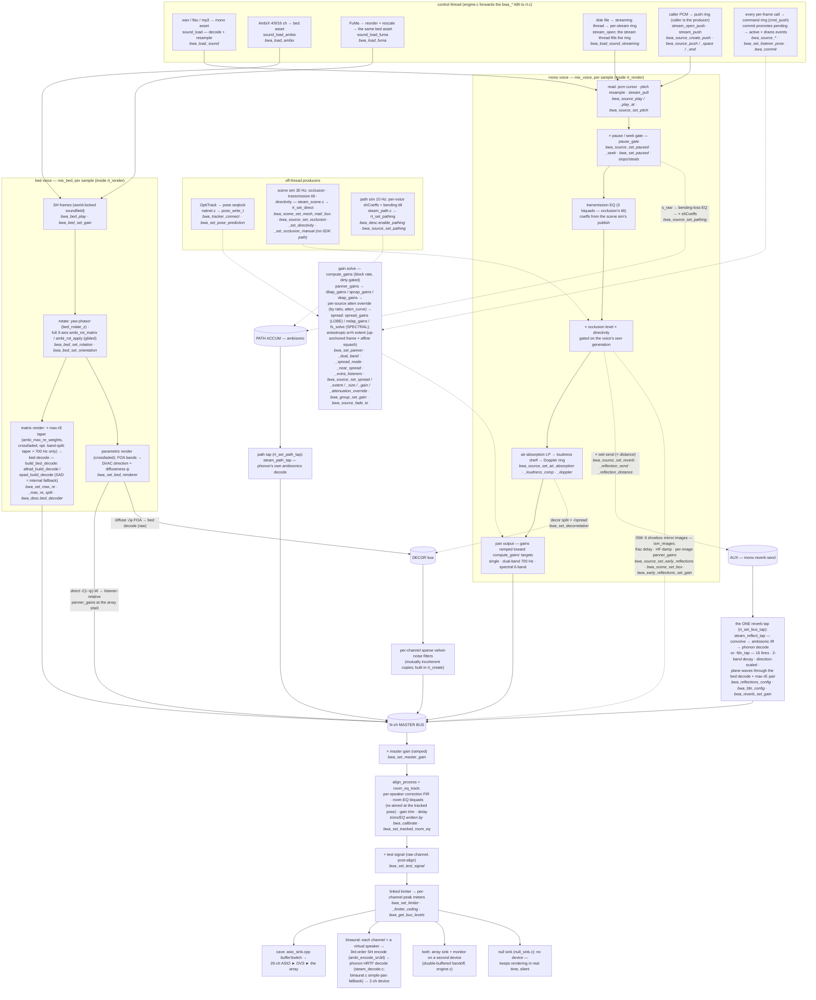

# Signal flow (rendered, with the code map)

The full render path as a Mermaid graph — structurally the same as the ASCII diagram in
[`architecture.md`](architecture.md) ("The full render path"), which stays the canonical,
raw-readable version; **edit that one first and keep this in sync**. On top of the structure,
this page carries the *code map*: each stage names the function(s) that implement it (plain
text, mostly `rt.c` and the module files) and the `bwa_*` calls that configure it (italics).
The tap-order rationale (why the sends branch where they do) lives with the ASCII diagram.

Reading the map: plain function names are where the DSP *runs* (almost all on the audio
thread, inside one `rt_render` block); italic `bwa_*` names are the control-thread calls
that *configure* that stage — every one of them crosses over via the command ring or an
atomic, never by touching DSP state directly (`concurrency.md` is the contract).
